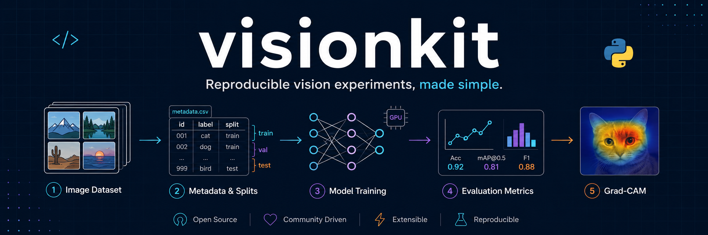

# visionkit

<p align="center">
  
</p>

`visionkit` is a small PyTorch package for image-classification projects where
image metadata is stored in a CSV file and the image files live in a directory.
It provides a reusable workflow for training, evaluation, prediction tables, and
Grad-CAM visualization.

It turns the notebook workflow into a package that can be reused with different
CSV files and image folders:

- Load image filenames, labels, and train/validation splits from a CSV
- Train torchvision models such as EfficientNet or ResNet
- Save checkpoints, training logs, prediction CSVs, and metric CSVs
- Generate Grad-CAM heatmaps and overlay images

## Quick Start

Prepare an image directory and a CSV file.

```text
your_project/
  data/
    images/
      case001.png
      case002.png
      case003.png
    meta.csv
  outputs/
```

The minimal `meta.csv` should look like this:

```csv
filename,label,split
case001.png,F,train
case002.png,N,train
case003.png,F,validation
case004.png,N,validation
```

Train a model:

```bash
visionkit train \
  --csv data/meta.csv \
  --image-dir data/images \
  --output-dir outputs/experiment_001 \
  --classes F N \
  --positive-class N \
  --epochs 30
```

Evaluate the validation split:

```bash
visionkit evaluate \
  --csv data/meta.csv \
  --image-dir data/images \
  --output-dir outputs/experiment_001 \
  --checkpoint outputs/experiment_001/models/best.pt \
  --classes F N \
  --positive-class N \
  --split validation
```

Generate Grad-CAM overlays:

```bash
visionkit gradcam \
  --csv data/meta.csv \
  --image-dir data/images \
  --output-dir outputs/experiment_001 \
  --checkpoint outputs/experiment_001/models/best.pt \
  --classes F N \
  --positive-class N \
  --split validation \
  --target-class N
```

## Required CSV

For CLI training, the CSV usually needs these three columns.

| column | required | example | meaning |
| --- | --- | --- | --- |
| `filename` | yes | `case001.png` | Image path relative to `--image-dir` |
| `label` | yes | `F` / `N` | Class label |
| `split` | yes | `train` / `validation` | Which split the row belongs to |

The default column names are `filename`, `label`, and `split`. If your CSV uses
different names, pass them explicitly:

```bash
visionkit train \
  --csv data/metadata.csv \
  --image-dir data/fig \
  --output-dir outputs/run_001 \
  --filename-column image_name \
  --label-column diagnosis \
  --split-column fixed_family_level_split \
  --train-split train \
  --val-split validation
```

Extra CSV columns are allowed. Columns such as `patient_id`, `family_id`, or
`age` are carried through into the prediction CSVs.

```csv
filename,label,split,patient_id,family_id
case001.png,F,train,P001,A
case002.png,N,train,P002,B
case003.png,F,validation,P003,C
```

## Image Paths

`filename` is interpreted as a path relative to `--image-dir`.

If all images are in the same folder:

```csv
filename,label,split
case001.png,F,train
case002.png,N,validation
```

If images are stored in subfolders, include the subfolder in `filename`:

```csv
filename,label,split
train/case001.png,F,train
validation/case002.png,N,validation
```

This expects files like:

```text
data/images/train/case001.png
data/images/validation/case002.png
```

## Classes And Positive Class

For binary classification, the order of `--classes` defines the class indices.

```bash
--classes F N
```

This means:

- `F` is class 0
- `N` is class 1

If you want AUC, sensitivity, specificity, and PR-AUC to use a specific positive
class, set it explicitly:

```bash
--positive-class N
```

If `--classes` is omitted, class names are inferred from the labels in the CSV.
For reproducible research or paper figures, it is better to pass `--classes`
explicitly because class order affects the numeric labels and positive class.

## Outputs

With `--output-dir outputs/experiment_001`, the package creates files like:

```text
outputs/experiment_001/
  models/
    best.pt
    epoch_001.pt
    epoch_002.pt
  logs/
    training_history.csv
  predictions/
    validation_predictions.csv
    validation_predictions_metrics.csv
    gradcam_validation.csv
    gradcam_validation_metrics.csv
  gradcam/
    validation/
      case001__pred-N.png
```

By default, `best.pt` is the checkpoint from the epoch with the best `val_auc`.

## Common Commands

Use a torchvision model other than EfficientNet-B3:

```bash
visionkit train \
  --csv data/meta.csv \
  --image-dir data/images \
  --output-dir outputs/resnet50_run \
  --architecture resnet50 \
  --image-size 224x224 \
  --classes F N \
  --positive-class N
```

Use a CSV layout similar to the original notebook:

```bash
visionkit train \
  --csv train_val/data/meta/fixed/fixed_family_level_split.csv \
  --image-dir train_val/data/fig \
  --output-dir train_val/review_outputs/family_level_split_efficientnetb3_seed123 \
  --filename-column filename \
  --label-column label \
  --split-column fixed_family_level_split \
  --train-split train \
  --val-split validation \
  --classes F N \
  --positive-class N \
  --architecture efficientnet_b3 \
  --image-size 300x300
```

## Python API

```python
from pathlib import Path

from visionkit.config import ExperimentConfig
from visionkit.pipeline import run_training, run_evaluation, run_gradcam

config = ExperimentConfig(
    csv_path=Path("data/meta.csv"),
    image_dir=Path("data/images"),
    output_dir=Path("outputs/experiment_001"),
    class_names=["F", "N"],
    positive_class="N",
    split_column="split",
    train_split="train",
    val_split="validation",
    architecture="efficientnet_b3",
    image_size=(300, 300),
    epochs=30,
)

model, history = run_training(config)

predictions, metrics = run_evaluation(
    config,
    checkpoint_path=config.output_dir / "models" / "best.pt",
    split_name="validation",
)

gradcam_results, gradcam_metrics = run_gradcam(
    config,
    checkpoint_path=config.output_dir / "models" / "best.pt",
    split_name="validation",
    target_class="N",
)
```

## Install

Use the package locally in editable mode:

```bash
pip install -e .
```

If PyTorch is not installed yet, install `torch` and `torchvision` first using
the command appropriate for your CPU or CUDA environment.
